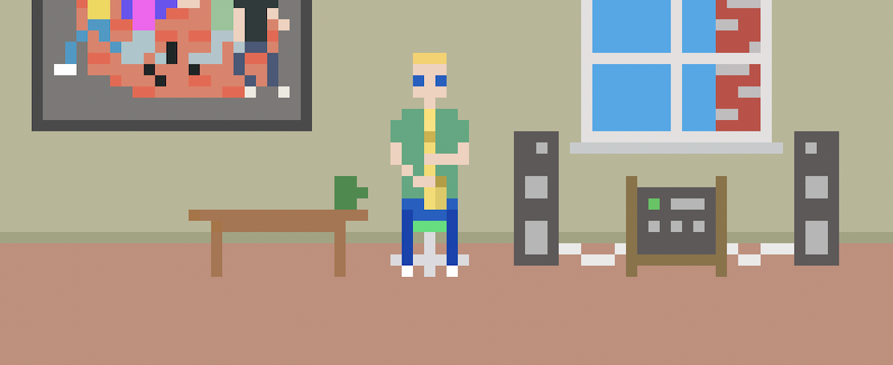

# Epic Sax Game

## [Play Online](https://pippinbarr.com/epic-sax-game/) (desktop, flash emulation with [ruffle](https://ruffle.rs))

## Description

*Daaaah! Dah dahdah dahdah-dah! Dah dahdah dahdah-dah! Daaaaaahdah daaaaaadah dah dah dah dah dah! Yes! Epic Sax Guy is now the star of his very own game! You, too, can live out the Epic Sax Life! Play your saxophone in a variety of settings! Practice in your room! Win Eurovision 2010! Win YouTube! Do it all!*

*Epic Sax Game* was written in ActionScript 3 using Adobe's FlashBuilder 4.5 and the excellent [Flixel](http://www.flixel.org/) library. It is based on the Eurovision song ["Run Away" by SunStroke Project and Olia Tira](http://www.youtube.com/watch?v=C-VMHOlCyW8) and the immortal ["Epic Sax Guy 10 Hours"](http://www.youtube.com/watch?v=KHy7DGLTt8g). The music comes from the MIDI version of the song made by [David Sexton](http://www.midi.ru/home/138892/). The font in *Epic Sax Game* is [Commodore 64 Pixelized](http://www.dafont.com/commodore-64-pixelized.font) by [Devin Cook](http://www.devincook.com/). The game is now being presented in emulation thanks to [ruffle](https://ruffle.rs).

## Press

* [Kill Screen](https://killscreen.com/previously/articles/play-day-epic-sax-swinging-epic-sax-game/)
* [The Verge](http://www.theverge.com/2012/3/27/2906548/epic-sax-guy-game-pippin-bar)
* ~~[IndieGames.com](http://indiegames.com/2012/03/browser_game_pick_epic_sax_gam.html)~~
* [Rock, Paper, Shotgun](http://www.rockpapershotgun.com/2012/03/29/kenny-g-hero-epic-sax/)
* ~~[Superlevel](http://superlevel.de/spiele/epic-sax-game) (in German!)~~
* [Free Indie Games](http://www.freeindiegam.es/2012/03/epic-sax-game-pippin-barr/).

## Documentation

* Read the [Process documentation](../process)
* Look at the [code repository](https://github.com/pippinbarr/epic-sax-game) for source code, the original .swf file etc.

## License

*Epic Sax Game* is an open source game licensed under a [Creative Commons Attribution-NonCommercial 3.0 Unported License](http://creativecommons.org/licenses/by-nc/3.0/). You can obtain the source code from its [code repository](https://github.com/pippinbarr/epic-sax-game).
